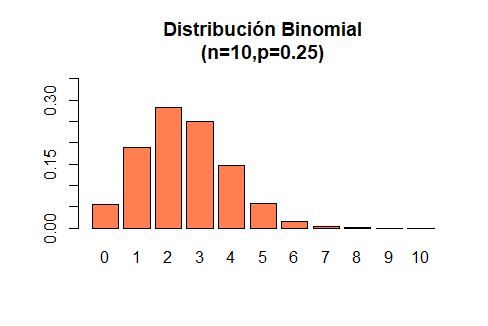

```{r setup, include=FALSE}
knitr::opts_chunk$set(echo = FALSE)
library(MASS)
library(psych)
library("knitr")
library(Rlab)
```


## **PLAN DE LA CLASE**

**1.- Introducción**

- Clasificación de variables aleatorias.
- Observar y predecir una variable cuantitativa continua.
- Observar y predecir una variable cuantitativa discreta.
- Observar y predecir variables binarias.

**2.- Práctica con R y Rstudio cloud**

- Observa y predice una variable aleatoria continua con distribución Normal.

- Observa y predice variables aleatorias discretas con distribución Bernoulli o Binomial.

- Elabora un reporte dinámico en formato pdf.

## **TIPOS DE VARIABLES ALEATORIAS**

```{r, echo=FALSE, out.width = '80%', fig.align='center'}
knitr::include_graphics("TiposVariables.jpg")
```

## **VARIABLE ALEATORIA CUANTITATIVA CONTINUA**

**Definición:** Puede tomar cualquier valor dentro de un intervalo (a,b), (a,Inf), (-Inf,b),(-Inf,Inf) y la probabilidad que toma cualquier punto es 0, debido a que existe un número infinito de posibilidades.

```{r, echo=FALSE, out.width = '70%', fig.align='center'}

```

## **OBSERVAR UNA VARIABLE CUANTITATIVA CONTINUA**

Al observar con un histograma **hist()** notamos que: 

1. La frecuencia o probabilidad en un intervalo es distinta de cero.  
2. Cuando aumenta el **n** muestral se perfila una distribución llamada **normal**.    

```{r, echo=FALSE, out.width = '70%', fig.align='center'}
par(mfrow=c(1,2))
set.seed(123)
q<-rnorm(50, 0, 1)
hist(q, col="red", main = "Histograma n= 50", xlab = "Variable cuantitativa continua")
q1<-rnorm(10000, 0, 1)
hist(q1, col="red", main = "Histograma n= 10000", xlab = "Variable cuantitativa continua")
```

## **PREDECIR UNA VARIABLE CUANTITATIVA CONTINUA**

Podemos predecir la probabilidad de que la variable aleatoria tome un determinado valor usando la función de densidad empírica **density()**.

```{r , echo=FALSE, out.width = '80%', fig.align='center'}
q2<-rnorm(100000, 0, 1)
plot(density(q2), main = "Función de densidad empírica")

```

## **PREDECIR VARIABLES CONTINUAS 2**

Podemos predecir la probabilidad de que la variable aleatoria tome un valor menor o igual a un determinado valor, usando la función de distribución empírica acumulada **ecdf()**.

```{r}
 
plot(ecdf(q2),main= "Función de distribución empírica acumulada", col="red")
```

## **OBSERVAR CON BOXPLOT**

Las gráficas de cajas y bigotes (**boxplot()**) son muy adecuadas para observar variables aleatorias continuas.

[^1]: **IQR =** **_Rango intercuantílico_** es la diferencia entre el tercer cuartil (75%) y el primer cuartil (25%) de una distribución.

```{r, echo=FALSE, out.width = '80%', fig.align='center'}

knitr::include_graphics("Boxplot.png")
```

## **VARIABLES ALEATORIAS DISCRETAS**

Las variables aleatorias discretas son aquellas que presentan un número contable de valores; por ejemplo:

* **Color del salmón**: Escala salmofan 20-34.

* **Número de parásitos** (1, 3, 5, 6, etc.).

* **Número de días a la muerte durante desafío contra patógenos** (1, 2, 3,..., 40).


## **IMPORTANCIA DE IDENTIFICAR Y ANALIZAR VARIABLES ALEATORIAS DISCRETAS**

* En gran parte, la **_distribución de variables aleatorias discretas_** suelen ser **asimétricas a derecha o a izquierda**.

* Usualmente las variables en estudio son conteos, proporciones o variables binarias (0 y 1); deben ser tratadas como **variables aleatorias discretas**. 

* Según sea la variable aleatoria discreta, tendrá una función de distribución de probabilidad asociada **(Bernoulli, Binomial, Binomial Negativa, Poisson, entre otras)**. 

* Es importante identificar la naturaleza que tiene nuestra variable en estudio, y así evitar errores en los análisis estadísticos que llevemos a cabo. 

## **CASOS ESPECIALES**

**1.- Variable aleatoria binaria:** Posee dos resultados posibles; por ejemplo, éxito o fracaso, macho o hembra, sano o enfermo, (0,1).

**2.- Variable aleatoria dependiente del tiempo:** 

**a) Discreta:** Días a la muerte de un organismo o fallo de un componente en un sistema en un tiempo *t*.  
  
**b) Continua:** Señales de sensores ambientales o señales biométricos.
  
Algunas de estas variables se conocen como **series de tiempo** y en términos estrictos son más bien una *sucesión de variables aleatorias* a través del tiempo.

## **EJEMPLO VARIABLE ALEATORIA BINARIA - DISTRIBUCIÓN BERNOULLI**

Se saca un camarón al azar de una piscina, la probabilidad de que tenga sindrome de la mancha blanca es de 0.35. Sea X=1 si el camarón tiene sindrome de la mancha blanca y X=0 en el caso de que no tenga sindrome de la mancha blanca. ¿Cuál es la distribución de X?

|             | Fracaso | Éxito |
|-------------|---------|-------|
| x           | 0       | 1     |
| f(x)=P(X=x) | 1-p     | p     |
|             | 0.65    | 0.35  |

```{r, echo=FALSE, out.width = '70%', fig.align='center'}

knitr::include_graphics("fbernoulli.png")
```

## **EJEMPLO VARIABLE ALEATORIA DISCRETA - DISTRIBUCIÓN BINOMIAL**

```{r, echo=FALSE, out.width = '80%', fig.align='center', fig.cap="Número de parásitos por pez"}

```

## **FORMATO CORRECTO PARA IMPORTAR A R**
```{r, echo=FALSE, out.width = '55%', fig.align='center', fig.cap="Formato correcto de archivo excel para que sea importado a R"}
knitr::include_graphics("Excel_ok.png")
```

## **ERRORES EN FORMATO EXCEL**
```{r, echo=FALSE, out.width = '80%', fig.align='center', fig.cap="Errores comunes antes de importar a excel"}
knitr::include_graphics("Errores_1.png")
```

**Importante:** No colocar símbolos matemáticos por ejemplo (%,$,+) como nombres de las **(variables)**.

## **ERRORES EN FORMATO EXCEL 2**
```{r, echo=FALSE, out.width = '80%', fig.align='center', fig.cap="Errores comunes antes de importar a excel"}
knitr::include_graphics("Errores.png")
```

**Importante:** No colocar comentarios en las celdas de datos. Dejar celdas vacias o usar el simbolo *NA* es preferido cuando hay datos faltantes.

## **COMO IMPORTAR DATOS EXCEL A R**

Antes de importar un archivo en formato excel (**.xlsx o .xls**) debe instalar y tener habilitada la librería **readxl**

```{r, echo=TRUE, out.width = '100%', fig.align='center'}
library(readxl)
dat <- read_excel("shrimp.xlsx", sheet = 1)
dat <- read_excel("shrimp.xlsx", sheet = "shrimp")
```

## **PRÁCTICA ANÁLISIS DE DATOS**

1.- Guía de trabajo Rmarkdown disponible en drive.  
**Clase 03-Introducción variables aleatorias**

2.- La tarea se realiza en Rstudio.cloud, proyecto (**Clase 03-Introducción variables aleatorias**).

## **RESUMEN DE LA CLASE**

- Identificamos  y clasificamos variables aleatorias.

- Observamos una variable cuantitativa continua usando histogramas y boxplot.

- Predecimos el comportamiento de una variable cuantitativa continua con distribución normal usando funciones de densidad y de distribución acumulada.

- Estudiamos sobre variables aleatorias discretas y algunas distribuciones de probabilidad asociadas (Bernoulli y Binomial).

