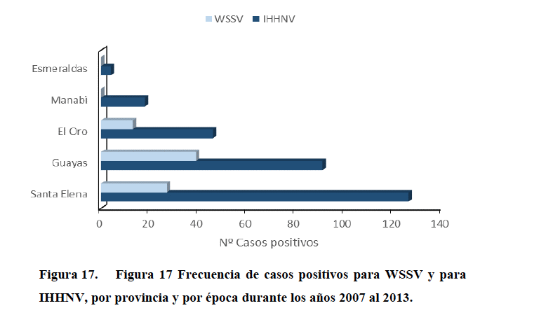
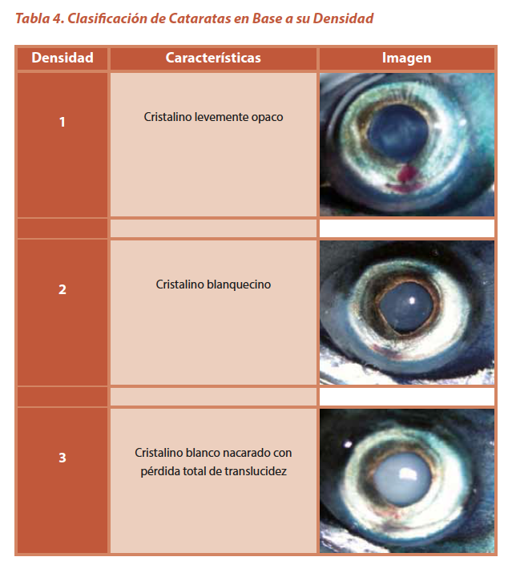
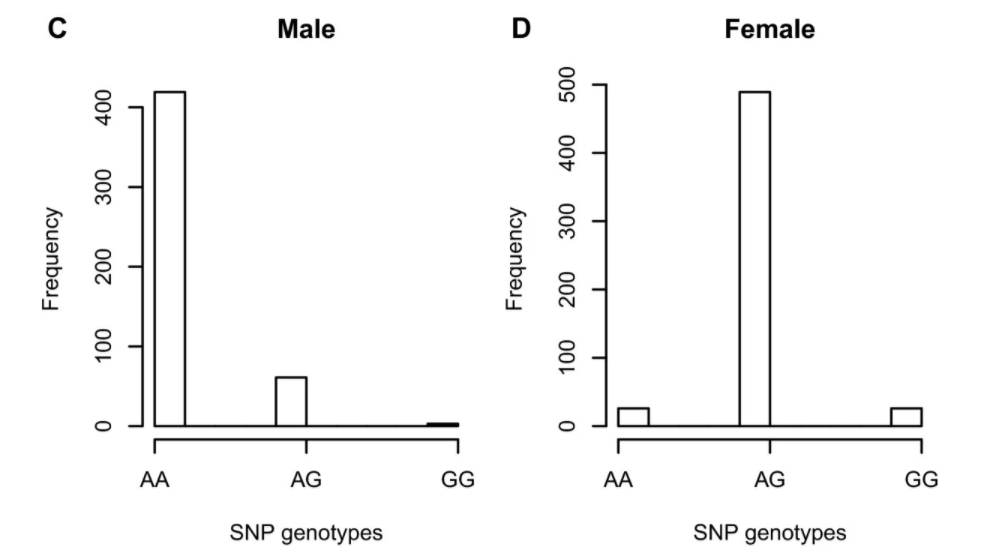
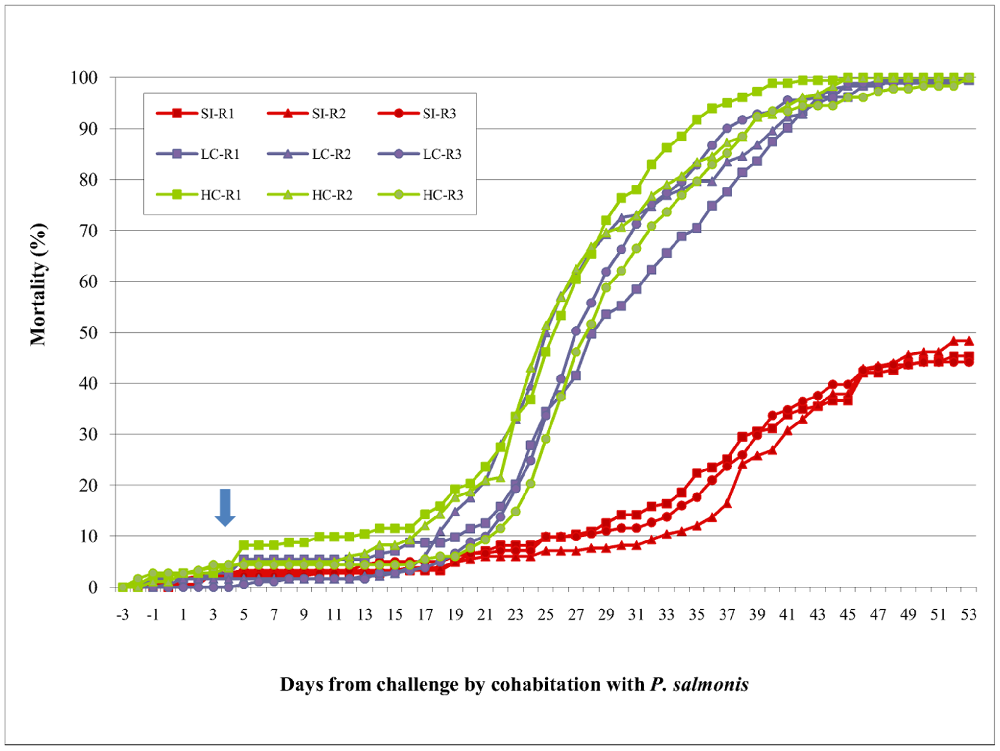
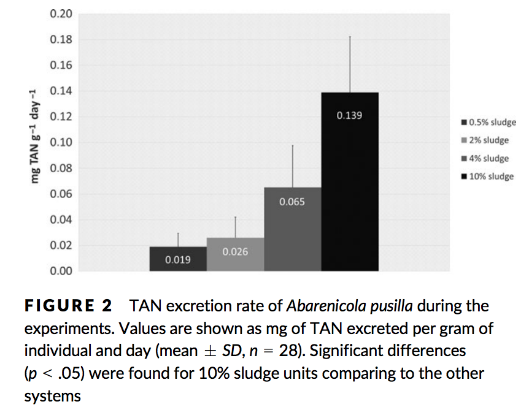
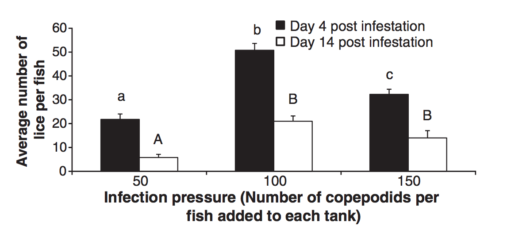
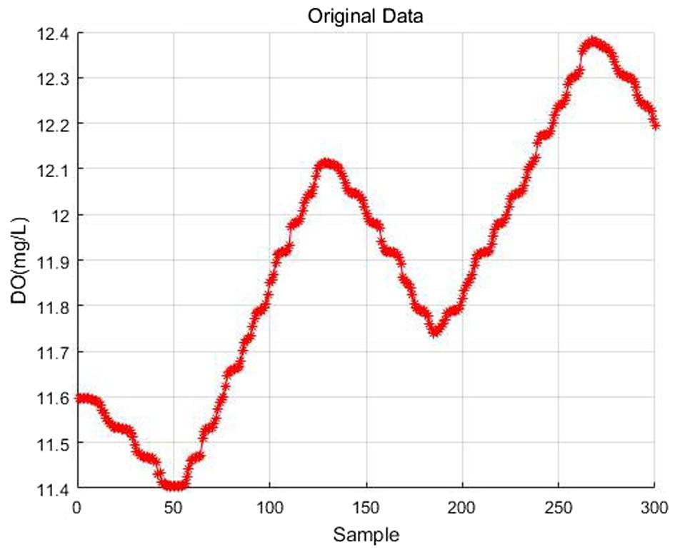

```{r setup, include=FALSE}
knitr::opts_chunk$set(echo = FALSE)
```

## PLAN DE LA CLASE
**1.- Introducción**

- Identificar conceptos asociados a variables aleatorias.  

- Identificar variables aleatorias en estudios de caso.

## IDENTIFICAR CONCEPTOS
**Identifique la definición de los siguientes conceptos**

Conceptos de variables

A.	Variable.
B.	Variable aleatoria.
C.	Variables cuantitativas discretas.
D.	Variables cuantitativas continuas.
E.	Variable categórica nominal
F.	Variable categórica ordinal.

*Responda en el documento compartido llamado Clase 4 Actividad
de aprendizaje disponible en el Drive del curso.*

## ESTUDIO DE CASO

A continuación se reportan resultados de varios estudios de análisis
de datos de acuicultura.

Responda para cada estudio de caso:

1.- ¿Cuál es la/las variable/s en estudio?  
2.- ¿Que tipo de variable/s aleatoria es/son?  
3.- ¿Tienen distribución normal?  

*Responda en el documento compartido llamado Clase 4 Actividad
de aprendizaje disponible en el Drive del curso.*

## CASO 1 - ENFERMEDADES CAMARON

Tesis enfermedades del Camarón *Litopenaeus vannamei*
Rodriguez, 2016.

```{r, echo=FALSE, out.width = '80%' }

```

## CASO 2 - CATARATAS EN SALMON

Informe etiología e Identificación de Cataratas. INTESAL,
2014.

```{r, echo=FALSE, out.width = '60%' }

```

## CASO 3 - GENÉTICA DEL SEXO EN CAMARON

Paper marcador genético asociada al sexo en camarón Tigre
*Penaeus monodon*. Robinson, 2014

```{r, echo=FALSE, out.width = '80%' }

```

## CASO 4 - COINFECCIÓN Y MORTALIDAD EN SALMON

Paper efecto de coinfección en mortalidad de salmon del
Atlántico. Lhorente, 2014

```{r, echo=FALSE, out.width = '80%' }

```

## CASO 5 - BIORREMEDIACIÓN EN SISTEMA RAS

Paper biorremediación por poliquetos en sistema RAS.
Gomez, 2018.

```{r, echo=FALSE, out.width = '80%' }

```

## CASO 6 - PIOJOS DE MAR

Paper infestación de salmón con piojos de mar. Araya, 2012.

```{r, echo=FALSE, out.width = '80%' }

```

## CASO 7 - OXÍGENO DISUELTO

Paper Predicción del Oxigeno disuelto en “China Ponds”. Li,
2018.

```{r, echo=FALSE, out.width = '80%' }

```


