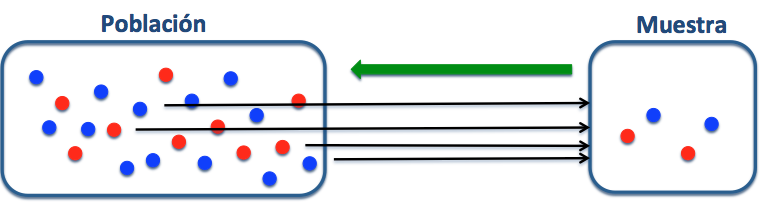
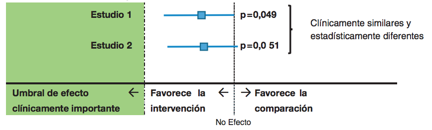
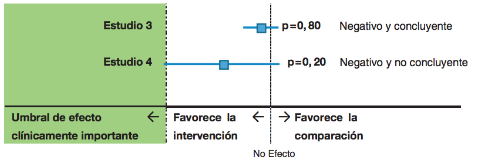
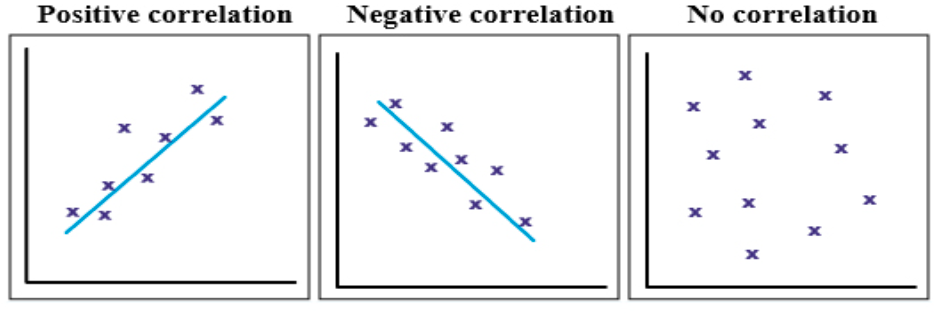
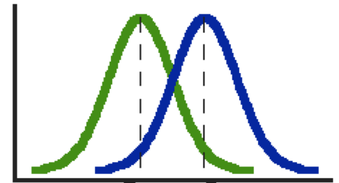

```{r setup, include=FALSE}
knitr::opts_chunk$set(echo = FALSE)
library(ggplot2)
library(UsingR)
```

# PLAN DE LA CLASE
**1.- Introducción**
    
- ¿Qué es la inferencia estadística?.   
- Conceptos importantes.
- ¿Cómo someter a prueba una hipótesis?
- Interpretar resultados de análisis de datos con R.

**2.- Práctica con R y Rstudio cloud**

- Realizar pruebas de hipótesis: Correlación, comparación de medias (2 muestras independientes).
- Realizar gráficas avanzadas con ggplot2. 
- Elaborar un reporte dinámico en formato pdf.  

# INFERENCIA ESTADÍSTICA

**¿Qué es la inferencia estadística?**

Son procedimientos que permiten obtener o extraer conclusiones sobre los parámetros de una población a partir de una muestra de datos tomada de ella.

**¿Qué inferencia puede hacer de este experimento?**

```{r, echo=FALSE, out.width = '100%' }

```

# INFERENCIA ESTADÍSTICA 2

**¿Para qué es útil?**  

- **Es más económico que hacer un Censo.**  
  ¿Cuántas larvas hay a mi estanque? 
  
- **Bajo ciertos supuestos permite hacer afirmaciones.**  
  Con la dieta A mis camarones crecen más que con la dieta B.  
  La eficacia de la vacuna es baja/alta.   
  
# CONCEPTOS IMPORTANTES

- **Parámetro**
Constante que caracteriza a todos los elementos de un conjunto de datos de una población. Se representan con letras griegas.

Promedio de una población (mu) = $\mu$.
 
- **Estadístico**
Una función de una muestra aleatoria o subconjunto de datos de una población.

Promedio de una muestra ($\bar{X}$) = $\sum$ $\frac{X_i}{n}$

# ESTIMACIÓN DE UN PARÁMETRO

**Objetivo:**  
Estimar parámetros de la población a partir de la muestra de una variable aleatoria.

**Ejemplo**  
A partir del muestreo de 30 peces estimo el promedio del peso del cuerpo de un estanque.

**Tipos de estimación**    

- **Estimación puntual:** Consiste en asumir que el parámetro tiene el mismo valor que el estadístico en la muestra.  

- **Estimación por intervalos:** Se asigna al parámetro un conjunto de posibles valores que están comprendidos en un intervalo asociado a una cierta probabilidad de ocurrencia. 

# ¿PUEDO ESTIMAR ERRÓNEAMENTE UN PARÁMETRO?

Por supuesto, muchos errores se producen por violar algunas premisas.

- **Las muestras deben tomarse de forma aleatoria.**  
  No descartar animales pequeños en un muestreo (sobreestimaré la biomasa).

- **Ley de los grandes números.**  
  ¿Mis variables están correlacionadas?
  3 muestras v/s 300 muestras.    

- **Evitar sesgo del investigador**  
  Deseo acaptar la hipótesis "la vacuna funciona" repito hasta que funciona.
  
- **Otros**  
  Errores, equipos descalibrados, fraude.

# DISTRIBUCIÓN DEL ESTIMADOR

- **Distribución muestral del estimador**  
Dado que un estimador puntual ($\bar{X}$) también es una variable aleatoria, entonces también tiene una distribución de probabilidad asociada.

- **¿Cómo distribuye?**  
Si X ~ *Normal*($\mu_{x}$,$\sigma_{x}$)

Entonces el estimador de la media tiene
$\bar{X}$ ~ *Normal*($\mu_{x}$, $\frac{\sigma_x}{\sqrt{n}}$)

- **¿Por qué es importante?**  
Conocer la distribución de $\bar{X}$ nos permitirá hacer
pruebas de hipótesis.

# PRUEBAS DE HIPÓTESIS

**Objetivo**  
Realizar una afirmación acerca del valor de un parámetro, usualmente contrastando con alguna hipótesis.

**Hipótesis estadísticas**  
*Hipótesis nula* (H~0~) es una afirmación, usualmente de igualdad. 

*Hipótesis alternativa* (H~A~) es una afirmación que se deduce de la observación previa o de los antecedentes de literatura y que el investigador cree que es verdadera.

**Ejemplo**  
**H~0~**: El peso medio de mis peces es menor o igual a 1 Kg.  
**H~A~**: El peso medio de mis peces es mayor a 1 Kg.  

# ¿POR QUÉ DOS HIPÓTESIS?

- Las pruebas estadísticas tienen como propósito someter a prueba una hipótesis nula con la intención de **_rechazarla_**.

- ¿Por qué no simplemente aceptar la hipótesis alternativa?

- Porque pueden existir otros fenómenos no conocidos o no considerados que posteriormente permitan a otro investigador rechazar nuestra hipótesis alternativa.	

- Por lo tanto, los datos nos dirán si **existen o no** evidencias para rechazar la hipótesis nula.

# ETAPAS DE UNA PRUEBA DE HIPÓTESIS

Para cualquier prueba de hipotesis necesitas lo siguiente:

- Tus **_datos_** (1).

- Una **_hipótesis nula_** (2).
 
- La **_prueba estadística_** (3) que se aplicará.

- El **_nivel de significancia_** (4) para rechazar la hipótesis.

- La **_distribución_** (5) de la **prueba estadística** respecto de la cual se evaluará la *hipótesis nula* con el estadístico que estimas de tus *datos*.


# PRUEBA DE HIPÓTESIS: NO RECHAZO.

**H~0~**: El peso medio de sus peces es menor o igual a 1 Kg.

Si **$\bar{X}$** = 1,05 Kg, rechaza la hipótesis? 

```{r, , echo=FALSE, out.width = '70%', fig.align='center'}
mediaMuestral=function(n){
  muestra=rnorm(n,1,1)
  media=mean(muestra)
  return(media)
}
m=10000
muchasMedias100=replicate(m,mediaMuestral(100))

hist(muchasMedias100,xlab="Media muestral", ylab="Frecuencia", col="lightcyan",
     xlim=c(0.5,1.5),freq=FALSE,ylim=c(0,4),
     main="Distribución medias muestrales", cex.lab = 1.5,
     cex.axis = 1.5)
curve(dnorm(x,1,sd(muchasMedias100)),xlim=c(0.5,1.5),col="blue",lwd=2,add=TRUE)
abline(v=1 , col="red", lwd=3)
abline(v=1.05, col="blue", lwd=5)
```

# PRUEBA DE HIPÓTESIS: RECHAZO.

**H~0~**: El peso medio de sus peces es menor o igual a 1 Kg.
 
Si **$\bar{X}$** = 1,2 Kg, rechaza la hipótesis?  

```{r, echo=FALSE, out.width = '70%', fig.align='center'}

hist(muchasMedias100,xlab="Media muestral", ylab="Frecuencia", col="lightcyan",
     xlim=c(0.5,1.5),freq=FALSE,ylim=c(0,4),
     main="Distribución medias muestrales", cex.lab = 1.5,
     cex.axis = 1.5)
curve(dnorm(x,1,sd(muchasMedias100)),xlim=c(0.5,1.5),col="blue",lwd=2,add=TRUE)
abline(v=1 , col="red", lwd=3)
abline(v=1.2, col="blue", lwd=5)
```


# ¿CUÁNDO RECHAZAR **H~0~**?

**Regla de decisión**  
Rechazo **H~0~** cuando la evidencia observada es poco probable que ocurra bajo el supuesto de que la hipótesis sea verdadera. 

Generalmente $\alpha$ = 0,05 o 0,01.

Es decir, rechazamos cuando el valor del estadístico está en el 5% inferior de la función de distribución muestral.

**Corrección de Bonferroni comparaciones múltiples**

Pero a veces $\alpha$ = $10^{-8}$  

Ejemplo: 50.000 genotipos asociados a un fenotipo.
Solo por azar 2.500 estarán asociados con P < 0,05

# PRUEBA DE HIPÓTESIS: UNA COLA O DOS COLAS

```{r, echo=FALSE, out.width = '100%',fig.align='center'}
knitr::include_graphics("region_rechazo.png")
```


# ¿PUEDO COMETER UN ERROR EN LAS PRUEBAS DE HIPÓTESIS?

Por supuesto, siempre es posible llegar a una conclusión incorrecta.

**Tipos de errores**  
Tipo I ($\alpha$) y tipo II ($\beta$), ambos están inversamente relacionados.

 **Decisión** |  **H~0~ es cierta** | **H~0~ es falsa** | 
---- | ---- | ---- |
*Aceptamos H~0~* | Decisión correcta | Error tipo II |
*Rechazamos H~0~* | Error tipo I | Decisión correcta |  


# SIGNIFICANCIA ESTADÍSTICA v/s PRÁCTICA
**Problema 1**   
La vacuna aumenta significativamente el número de anticuerpos. 

Sin vacuna = 10 anticuerpos   
Con vacuna = 11 anticuerpos (10 % de mejora de anticuerpos). 

¿Cuál es la importancia práctica de este hallazgo?  

¿Mejorará la salud de mis peces?


# SIGNIFICANCIA ESTADÍSTICA v/s PRÁCTICA 2
**Problema 2**
Si aumento **n** siempre lograré rechazar la hipótesis nula, cada vez para diferencias más pequeñas. ¿Esto tiene significancia práctica?

X e Y están significativamente correlacionados $\rho$ = 0,01 (p-value = 0.01901)

```{r, echo=FALSE, out.width = '80%',fig.align='center'}
gen.corr.data<- function(rho,n){
# first step: generate two normal random variables from normal distrbution
set.seed(123) 
X <- rnorm(n)
X2 <- rnorm(n)
 
# second step generate the correlated variable
 
Y<- rho*X+ sqrt(1-rho^2)*X2
result <-cbind(X,Y)
return(result)
}

muestra<-gen.corr.data(0.01,50000)
plot(muestra)
dat<- as.data.frame(muestra)
# cor.test(dat$x1, dat$x3)

```

# SIGNIFICANCIA ESTADÍSTICA v/s PRÁCTICA 3

**Problema 3**  

Significancia basada en un punto de corte arbitrario.
Abajo dos estudios son clinicamente similares, pero estadísticamente diferentes.

```{r, echo=FALSE, out.width = '100%' }

```

# SIGNIFICANCIA ESTADÍSTICA v/s PRÁCTICA 4

**Problema 4**  
Resultados "estadísticamente no significativos" pueden ser o no ser concluyentes.

```{r, echo=FALSE, out.width = '100%' }

```

# TIPOS DE PRUEBAS ESTADÍSTICAS

Según la forma de la distribución de la variable aleatoria.

- **Métodos paramétricos**
Las pruebas de hipótesis usualmente asumen una distribución normal de la variable aleatoria.

Útil para la mayoría de las variables cuantitativas continuas.

- **Métodos NO paramétricos**
Las pruebas de hipótesis no asumen una distribución normal de la variable aleatoria.

Útil para todas las variables, incluyendo cuantitativas discretas y cualitativas.


# COEFICIENTE CORRELACIÓN DE PEARSON

```{r, echo=FALSE, out.width = '100%',fig.align='center'}

```

**Hipótesis**
$H_0$ : $\rho$ = 0 ausencia de correlación **_vs_**.
$H_1$ : $\rho$ $\neq$ 0 existencia de correlación.

**Supuestos:**
	1) Las variables X e Y son continuas y su relación en lineal.  
	2) La distribución conjunta de (X,Y) es una distribución Bivariable normal

	
# ESTUDIO DE CASO: RELACIÓN ESTATURA PADRES - HIJOS

```{r, echo=FALSE, out.width = '100%',fig.align='center'}
plot(father.son$fheight, father.son$sheight, xlab = "ESTATURA PADRES", ylab = "ESTATURA HIJOS")
```

#  **Pearson's product-moment correlation**

```{r, echo=TRUE}
cor.test(father.son$fheight, father.son$sheight)
```

# PRUEBA DE COMPARACIÓN DE MEDIAS

```{r , echo=FALSE, out.width = '70%',fig.align='center'}

```

**Hipótesis**
$H_0$ : $\mu_1$ = $\mu_2$ **_vs_**. $H_1$ : $\mu_1$ $\neq$ $\mu_2$  


**Supuestos:**
1) Las variables X es continua.
2) Distribución normal.


# ESTUDIO DE CASO: TAMAÑO EN TILAPIAS POR SEXO
       
```{r}
tilapia <- data.frame(Sexo=rep(c("Male", "Female"), each=10), Peso=c(rnorm(10, 180, 10),rnorm(10, 140, 10)))
 boxplot(tilapia$Peso ~ tilapia$Sexo, xlab = "Sexo", ylab = "Peso")
# t.test(Peso ~ Sexo, tilapia, alternative = c("two.sided"), var.equal=TRUE)
```

# **Two Sample t-test**

```{r, echo=TRUE}
t.test(Peso ~ Sexo, tilapia, alternative = c("two.sided"),
       var.equal=TRUE)
```


# PRÁCTICA ANÁLISIS DE DATOS
- Guía de trabajo práctico disponible en drive y Rstudio.cloud.  
**Clase_09**

- El trabajo práctico se realiza en Rstudio.cloud.  
** Guia clase 09 Inferencia estadística**

# RESUMEN DE LA CLASE

- **Elaborar hipótesis**

- **Realizar pruebas de hipótesis**
    * Test de correlación.  
    * Test de comparación de medias para 2 muestras independientes.

- **Realizar gráficas avanzadas con ggplot2**.    