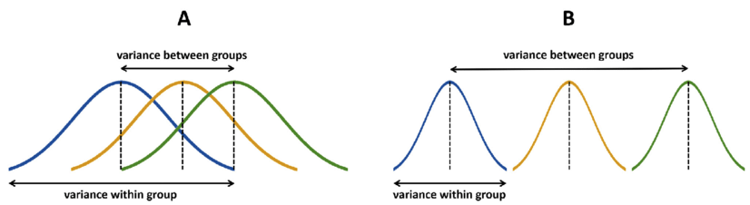

```{r setup, include=FALSE}
knitr::opts_chunk$set(echo = FALSE)
library(ggplot2)
library(UsingR)
library(dplyr)
library(knitr)
library(broom)
```

# PLAN DE LA CLASE
**1.- Introducción**
    
- ¿Qué es un análisis de varianza?.   
- Modelos lineales en Anova.
- Hipótesis y supuestos.
- Interpretar resultados de análisis de varianza con R.

**2.- Práctica con R y Rstudio cloud**

- Realizar guía 9 + Realizar pruebas de hipótesis: Anova y posteriores.
- Realizar gráficas avanzadas con ggplot2. 
- Elaborar un reporte dinámico en formato pdf.  

# ANOVA

**¿Qué es el análisis de varianza?**

Herramienta básica para analizar el efecto de uno o más factores (cada uno con dos o más niveles) en un experimento.

```{r, echo=FALSE, out.width = '100%' }
knitr::include_graphics("anova.png")
```

# PROBLEMA DE LAS COMPARACIONES MÚLTIPLES

**¿Por qué preferir anova y no múltiples t-test?**  
Porque con una t-test normal se incrementa la tasa de error al aumentar el número de comparaciones múltiples.

```{r, echo=FALSE, out.width = '60%',fig.align='center'}
knitr::include_graphics("problema.png")
```

Fuente[1]: [1]:doi:10.21037/jtd.2017.05.34 

# ANOVA: MODELOS LINENALES

Una forma muy conveniente de representar una ANOVA es mediante un modelo lineal.

**Modelo lineal para ANOVA de una vía**  
$y$ ~ $\mu$ + $\alpha$ + $\epsilon$   

**Modelo lineal para ANOVA de dos vías**  
$y$ ~ $\mu$ + $\alpha$ + $\beta$ + $\epsilon$     

**Modelo lineal para ANOVA de dos vías con interacción**  
$y$ ~ $\mu$ + $\alpha$ + $\beta$ + $\alpha$*$\beta$ + $\epsilon$

# ANOVA: HIPÓTESIS Y SUPUESTOS

**Hipótesis factor 1**  
**H~0~** : $\alpha_{1.1}$ = $\alpha_{1.2}$ = $\alpha_{1.3}$ 

**Hipótesis factor 2**  
**H~0~** : $\beta_{2.1}$ = $\beta_{2.2}$ = $\beta_{2.3}$  

**Hipótesis interacción**  
**H~0~** : $\alpha$*$\beta$ = 0

**Hipótesis Alternativa**  
**H~A~** : No todas las medias son iguales

**Supuestos:**  
	1) Independencia de las observaciones.  
	2) Normalidad.  
	3) Homocedasticidad: homogeneidad de las varianzas.  

# ANOVA PARA COMPARAR MEDIAS

**¿Por qué se llama ANOVA si se comparan medias?**  
Por que el estadístico **F** es un cociente de varianzas.     

**F** = $\frac{\sigma^2_{entre grupos}}{\sigma^2_{dentro grupos}}$

Mientras mayor es el estadístico **F**, más es la diferencia de medias entre grupos.  

```{r, echo=FALSE, out.width = '100%' }

```

# TEST POSTERIORES (PRUEBAS A POSTERIORI)

**¿Para qué sirven?**

Para identificar que pares de niveles de uno o más factores son significativamente distintos entre sí. 

**¿Cuando usarlos?**

Sólo cuando se rechaza **H~0~** del ANOVA. 

**Tukey test**  
Es uno de los más usados, similar al *t-test*, pero corrige la tasa de error por el número de comparaciones.

# ESTUDIO DE CASO: EVALUACIÓN DE DIETAS TRUCHA ARCOIRIS

```{r}
My_Theme = theme(
  axis.title.x = element_text(size = 18),
  axis.text.x = element_text(size = 18),
  axis.title.y = element_text(size = 18),
  axis.text.y = element_text(size = 18))

my_data <- PlantGrowth
my_data%>% 
  ggplot(aes(x=group,y=weight,fill=group))+
      geom_boxplot()+
     theme(legend.position="none")+
     labs(x="Dietas",y="Peso (g)")+My_Theme
colnames(my_data) <- c("Peso","Dietas")
```

# Anova de una vía.

```{r, echo=TRUE}
# Crea objeto anova
res.aov <- aov(Peso ~ Dietas, data = my_data)
# Imprime resultado en formato tabla.
anova(res.aov)%>% kable(caption = "Anova de una vía.",
                        digits=2)
```

**_aov()_** *sólo para diseños balanceados*

# Prueba de Tukey

```{r , echo=TRUE, out.width = '70%' }
tk <- TukeyHSD(res.aov)
tidy(tk) %>% kable(caption = "Prueba de Tukey.", digits=2,
col.names=c("Trat.","Contraste", "H0",
            "Diferencia", "IC-bajo","IC-alto",
            "p-ajustado"))
```

# ESTUDIO DE CASO: EVALUACIÓN CRECIMIENTO TILAPIA (TEMPERATURA Y SALINIDAD)

```{r}
my_data1 <- ToothGrowth
# my_data1
# table(my_data1$supp, my_data1$dose)
colnames(my_data1) <- c("Peso","Salinidad","Temperatura")
my_data1$Temperatura <- as.factor(my_data1$Temperatura)
levels(my_data1$Salinidad) <- c("Agua dulce","Agua de mar")
my_data1%>% 
  ggplot(aes(x=Temperatura,y=Peso,fill=Salinidad))+
      geom_boxplot()+
     labs(x="Temperatura",y="Peso (g)")+
  scale_x_discrete(labels = c('25ºC','30ºC','35ºC'))+My_Theme

```

# **Anova de dos vías con interacción**

```{r, echo=TRUE}
res.aov2 <- aov(Peso ~ Temperatura * Salinidad,
                data = my_data1)
anova(res.aov2)%>% kable(caption = "Anova de dos vías.",
                         digits=3)
```

# PRÁCTICA ANÁLISIS DE DATOS
- Guía de trabajo práctico disponible en drive y Rstudio.cloud.  
**Clase_10**

- El trabajo práctico se realiza en Rstudio.cloud.  
**Guía 10 Anova y posteriores**

# RESUMEN DE LA CLASE

- **Elaborar hipótesis**

- **Realizar análisis de varianza**
    * 1 factor.  
    * 1 factor con posteriores.
    * 2 factores con interacción.
    
- **Realizar gráficas avanzadas con ggplot2**    