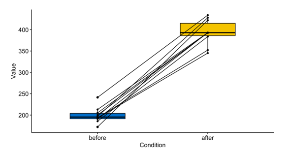

```{r setup, include=FALSE}
knitr::opts_chunk$set(echo = FALSE)
library(car)
library(lmtest)
library(ggplot2)
library(dplyr)
library(permute)
```

## PLAN DE LA CLASE
**1.- Introducción**
    
- ¿Qué son las pruebas no paramétricas?.
- Test de Correlación no paramétrico.
- Pruebas de contraste no paramétrico.
- Prueba de asociación Chi cuadrado.

**2.- Práctica con R y Rstudio cloud**

- Realizar pruebas no paramétricas.  
- Realizar gráficas avanzadas con ggplot2. 
- Elaborar un reporte dinámico en formato pdf.  

## MÉTODOS NO PARAMÉTRICOS

- Conjunto diverso de pruebas estadísticas.

- El concepto de “no paramétrico” a veces es confuso, pues los métodos no paramétricos si estiman y someten a prueban hipótesis usando parámetros, pero no los de distribución normal.

- Se aplican usualmente para variables cuantitativas que no cumplen con el supuesto de normalidad y para variables cualitativas.

- Alternativamente se conocen como métodos de distribución libre.

- El concepto matemático de permutación está subyacente a muchos métodos no paramétricos y se utiliza para someter a prueba las hipótesis.

## SUPUESTOS DE LOS MÉTODOS NO PARAMÉTRICOS

- Las variables son independientes.

- Muestras independienteds tienen identica distribución.

- No tienen supuestos acerca de la distribución de la variable.

- La distribución muestreal se estima a veces usando permutación.

## PRUEBA DE CORRELACIÓN NO PARAMÉTRICA

**¿Para que sirve?**    
Para estudiar asociación de dos variables, cuando no se cumple uno o varios supuestos de la correlación paramétrica: 

- Las variables X e Y no son continuas.  
- No existe relación lineal.  
- La distribución conjunta de (X, Y) no es una distribución Bivariable normal.  

## EJEMPLO FUNCIÓN MONÓTONA

**¿Cuál es el supuesto que no se cumple?**  
No existe una relación lineal

```{r, out.width = '80%' }
set.seed(123)
x <- 1:20
y <- (1/4) * x^2 # Funcion monotona creciente

plot(x, y, type = 'b', main = 'Relación no lineal', frame.plot = FALSE, col = "dark red", lwd=2, font=2, cex.axis = 1.5)
```


## EJEMPLO VARIABLES DISCRETAS U ORDINALES

**¿Cuál es el supuesto que no se cumple?**  
Parásitos es variable discreta.

```{r, out.width = '80%' }
set.seed(0)
x <- trunc(runif(200)*10)
y <- x * 3 + trunc(runif(200)*10)
plot(y,x,pch=16, xlab = "Tamaño del pez", ylab = "parásitos", col = "red")
```

## COEFICIENTE DE CORRELACIÓN DE SPEARMAN

**¿Cómo se calcula?**   

$$\rho = 1- \frac {6\sum d^2}{n(n^2-1)} = -0,6 = rho$$

|  **Fish size (X)** | **Parásitos (Y)**| **Ranking X ** | **Ranking Y** | $$d$$  | $$d^2$$ |
|:-----:|:-----:|:-------:|:------:|:------:|:------:|
| 942 | 13 | 4 | 2 | 2 | 4 |
| 101 | 14 | 1 | 3 | -2 | 4 |
| 313 | 18 | 2 | 4 | -2 | 4 |
| 800 | 10 | 3 | 1 | 2 | 4 |
$$\sum d^2 = 16$$ 

## ¿CUÁNTAS CORRELACIONES SON POSIBLES?

Para 4 elementos el número de permutaciones (combinación ordenada de elementos) es: 4! = 4 x 3 x 2 x 1 = 24 permutaciones posibles.

::: columns

:::: column
Opción 1: Correlación negativa.

| **Ranking X ** | **Ranking Y** |
|:----:|:-------:|
| 4 | 1 | 
| 1 | 4 |
| 2 | 3 |
| 3 | 2 | 
| $$\rho$$ = -1 |
::::

:::: column
Opción 2: Correlación positiva.

| **Ranking X **| **Ranking Y**  |
|:--------:|:-------:|
| 4 | 4 | 
| 1 | 1 | 
| 2 | 2 | 
| 3 | 3 | 
|$$\rho$$ = 1 |

::::

:::

## DISTRIBUCIÓN MUESTRAL DE CORRELACIÓN

¿Cuántas correlaciones son >= 0.6 y <= -0.6?

```{r, out.width = '80%'}

My_Theme = theme(
  axis.title.x = element_text(size = 18),
  axis.text.x = element_text(size = 18),
  axis.title.y = element_text(size = 18),
  axis.text.y = element_text(size = 18))

x<- c(-1.0, -0.8, -0.8, -0.8, -0.6, -0.4, -0.4, -0.4, -0.4, -0.2, -0.2, 0.0, 0.0,  0.2, 0.2, 0.4, 0.4, 0.4, 0.4, 0.6, 0.8, 0.8, 0.8, 1.0)

dat<-tibble(x)
dat <- dat %>% mutate(color=case_when((x >= 0.6) ~ 1, x <= -0.6 ~ 1, TRUE ~ 0))

g <- ggplot(dat, aes(x=x,fill= color>=1)) +
  geom_bar(show.legend = FALSE)+
   scale_fill_manual(values=c("TRUE"="firebrick","FALSE"="blue"))+
  scale_x_continuous(breaks = c(-1.0, -0.8, -0.6, -0.4, -0.2, 0.0, 0.2, 0.4, 0.6, 0.8, 1.0), limits = c(-1.1,1.1)) + 
  labs(x="Coeficiente de correlación")

g+My_Theme

```


## PRUEBA DE HIPÓTESIS DE CORRELACIÓN

|  **Hipótesis** | **Verdadera cuando**| 
|:-------------|:------------------|
| **H~0~**: X e Y mutuamente independientes | $$\rho$$ = 0|
| **H~1~**: X e Y no son mutuamente independientes | $$\rho$$ $$\ne$$ 0|

p = 10 / 24  
p = 0.4167

No se rechaza **H~0~** porque p = 0,416 es mayor a 0,05

## PRUEBA DE CORRELACIÓN CON R

```{r, echo=TRUE}
# Crea objetos X e Y 
X <- c(942,101,313,800)
Y <- c(13,14,18,10)

# Realiza test de correlación
cor.test(X,Y, method = "spearman",
         alternative = "two.sided")

```

## COMPARACIÓN DE MUESTRAS INDEPENDIENTES

**¿Para qué sirve?**   
Para comparar dos muestras con idéntica distribución, con diferentes medianas y sin normalidad.

Usualmente para variables discretas.

```{r, echo=FALSE, out.width = '80%' }
knitr::include_graphics("No_par.png")
```

## PRUEBA DE MANN-WHITNEY (W)

Estudio de caso: Conducta agresiva (minutos de pelea) entre tilapias cultivadas en estanque mosexo (Tratamiento: solo machos) y estanques mixtos (Control: Machos y hembras) [**Link**](https://doi.org/10.1590/S1519-69842008000400015)

|  **Tratamiento (T)** | **Control (C)**| 
|:----------:|:---------:|
| 9 | 0 |
| 12 | 4 | 
| 13 | 6 | 

## CÁCULO DE ESTADÍSTICO MANN-WHITNEY (W)

**¿Cómo se calcula el estadístico W?**   
Como la diferencia de los ranking entre tratamiento y control

|  **Tratamiento (T)** | **Control (C)**| **Ranking T ** | **Ranking C** |
|:----------:|:---------:|:--------:|:--------:|
| 9 | 0 | 4 | 1 | 
| 12 | 4 | 5 | 2 | 
| 13 | 6 | 6 | 3 | 
|  |  |  $$\sum$$ = 15 | $$\sum$$ = 6 |

*W* = 15 - 6 = 9  
Máxima diferencia posible entre T y C.


## ¿CUÁNTAS COMBINACIONES SON POSIBLES?

¿Cuántas combinaciones son posibles?

6! / 3! X 3! = 720 / 36 = 20

2 resultados posibles de 20  

::: columns

:::: column
Control mayor que tratamiento.

|  **T** | **C**| 
|:-----:|:--------:|
| 1 | 4 |
| 2 | 5 | 
| 3 | 6 |
|  *6*   | *15* | 
|  *W* =  | **- 9** |
::::

:::: column
Tratamiento mayor que Control.

| **T** | **C** |
|:---------:|:---------:|
 | 2 | 1 | 
| 5 | 3 | 
| 6 | 4 | 
| *13*  | *8* |
| *W* =    | **5** |

::::

:::


## DISTRIBUCIÓN MUESTRAL DE W

```{r, out.width = '90%'}
w<- c(-9, -7, -5, -5, -3, -3, -3, -1, -1, -1, 1, 1, 1, 3, 3, 3,5,5,7,9)

dat<-tibble(w)
dat <- dat %>% mutate(color=case_when((w >=9) ~ 1, TRUE ~ 0))

g <- ggplot(dat, aes(x=w,fill= color>=1)) +
  geom_bar(show.legend = FALSE)+
   scale_fill_manual(values=c("TRUE"="firebrick","FALSE"="blue"))+
  scale_x_continuous(breaks = c(-9, -7, -5, -5, -3, -3, -3, -1, -1, -1, 1, 1, 1, 3, 3, 3,5,5,7,9), limits = c(-10,10)) + 
  labs(x="Diferencia de rangos (W)")

g+My_Theme

```

## PRUEBA DE HIPÓTESIS DE MANN-WHITNEY

|  **Hipótesis** |
|:-------------:|
| **H~0~**: Tratamiento = Control |
| **H~1~**: Tratamiento > Control | 

Resultado obtenido W=9.  
p = 1/20  
p = 0.05  

No se rechaza **H~0~** porque p = 0,05


## PRUEBA DE MANN-WHITNEY CON R

```{r, echo=TRUE}
# Crea objetos tratamiento y control
t <- c(9, 12, 13)
c <- c(0, 4, 6)

# Realiza prueba de Mann-Whitney
wilcox.test(t, c, alternative = "g",
            paired = FALSE)
```

## COMPARACIÓN DE MUESTRAS PAREADAS

**¿Para que sirve?**   
Para comparar dos muestras *pareadas* con idéntica distribución, con diferentes medianas y sin normalidad.

```{r, echo=FALSE, out.width = '90%' }

```

## PRUEBA DE WILCOXON MUESTRAS PAREADAS

Estudio de caso: Gonadotrofina en trucha 7 y 14 días [**post ovulación.**](https://hal.inrae.fr/hal-02714224/document)

¿Aumenta la gonadotrofina post ovulación?

|  **Trucha** | **7 días**| **14 días** | $$d$$ |  Ranking con signo |
|:------:|:------:|:------:|:------:|:-------:|
| 1 | 45 | 49 | 4 | **2** |
| 2 | 41 | 50 | 9 | **4** |
| 3 | 47 | 52 | 5 | **3** |
| 4 | 52 | 50 | 2 | **-1** |

W = suma de los ranking = 8  
V = suma de casos positivos (aumenta) = 9


## DISTRIBUCIÓN MUESTRAL DE W

¿Cuántas combinaciones de signos (+ o -) son posibles?
$2^4=16$  

```{r, out.width = '90%'}
w<- c(-10, -8, -6, -4, -4, -2, -2, 0, 0, 2, 2, 4, 4, 6, 8, 10)

dat<-tibble(w)
dat <- dat %>% mutate(color=case_when((w >=8) ~ 1, TRUE ~ 0))

g <- ggplot(dat, aes(x=w,fill= color>=1)) +
  geom_bar(show.legend = FALSE)+
   scale_fill_manual(values=c("TRUE"="firebrick","FALSE"="blue"))+
  scale_x_continuous(breaks = c(-10, -8, -6, -4, -4, -2, -2, 0, 0, 2, 2, 4, 4, 6, 8, 10), limits = c(-11,11)) + 
  labs(x="Diferencia de signos (W)")

g+My_Theme

```


## PRUEBA DE HIPÓTESIS DE WILCOXON


|  **Hipótesis** |
|:-------------:|
| **H~0~**: d = 0 |
| **H~1~**: d > 0 | 

p = 2/16  
p = 0,125

No se rechaza **H~0~** porque p = 0,125 es mayor a 0,05

## PRUEBA DE WILCOXON PAREADAS CON R

```{r, echo=TRUE}
# Crea objetos pre y post
pre <- c(45, 41, 47, 52)
post <- c(49, 50, 52, 50)
# Realiza prueba de Wilcoxon
wilcox.test(post - pre, alternative = "greater")
# no es necesario indicar muestras pareadas
# pues estamos haciendo la resta en la función.

```

## COMPARACIÓN DE MÚLTIPLES MUESTRAS INDEPENDIENTES

**¿Para que sirve?**   
Para comparar múltiples muestras con idéntica distribución, con diferentes medianas y sin normalidad.

```{r, echo=FALSE, out.width = '90%' }
knitr::include_graphics("multiple.png")
```

## ESTUDIO DE CASO: SCORE CALIDAD CAMARÓN

Score de calidad organoléptica (textura) de camarón [**link**](https://iopscience.iop.org/article/10.1088/1755-1315/564/1/012040/pdf).

|  **Descripción** | **Puntaje**|
|:----|:---|
| Muy compacto y denso  | 9
| Menos elástico, compacto y denso | 7 | 
| No elástico, no compacto y no denso| 5 | 
| Ligeramente blando| 3 | 
| Suave| 1 | 

## PRUEBA DE KRUSKAL - WALLIS

Textura luego de 0, 4 y 8 días de almacenamiento de camarón congelado.

|  **0 días** | **4 días**| **8 días** | 
|:----|:---|:---|
| 9 | 7 | 6 | 
| 8 | 7 | 5 | 
| 9 | 6 | 5 | 
| 8 | 8 | 6 |

|  **Hipótesis** |
|:-------------:|
| **H~0~**: La distribución de los k grupos son iguales. |
| **H~1~**: Al menos 2 grupos son distintos. | 

## PRUEBA DE KRUSKAL - WALLIS CON R

```{r, echo=TRUE}
d0 <- c(9,8,9,8) # day0
d4 <- c(7,7,6,8) # day4 
d8 <- c(6,5,5,6) # day8
kruskal.test(list(d0, d4, d8))

```

## PRUEBA DE ASOCIACIÓN VARIABLES CATEGÓRICAS

**¿Para que sirve?**  
Se utilizan para investigar la asociación de dos o más variables categóricas una de las cuales es una variable respuesta y la otra es una variable predictora.

|  **Tratamiento** | **Respuesta +**| **Respuesta -** | 
|:----|:---|:---|
| Si | a | c | 
| No | b | d | 

## PRUEBA DE CHI CUADRADO

Esta prueba contrasta frecuencias observadas con las frecuencias esperadas de acuerdo con la hipótesis nula.

|  **Hipótesis** |
|:-------------:|
| **H~0~**: La variable predictora y la variable respuesta son independientes (Tratamiento = control) |
| **H~1~**: La variable predictora y la variable respuesta NO son independientes | 

**Supuestos:**  
- Los datos provienen de una muestra aleatoria de la población de interés.  
- El tamaño de muestra es lo suficientemente grande para que el número esperado en las categorías sea mayor 5 y que ninguna frecuencia sea menor que 1. 

## ESTUDIO DE CASO: SOBREVIVENCIA MANCHA BLANCA CAMARÓN

Sobrevivencia de postlarvas  alimentadas con *B* glucanos y desafiadas con WSSP  [**link**](https://www.int-res.com/articles/dao/36/d036p163.pdf).

|  **Tratamiento** | **Sobrevivientes**| **Muertos** | 
|:----|:---|:---|
| Con glucanos | 20 | 80 | 
| Sin glucanos | 5 | 95 | 

## CÁLCULO DE ESTADÍSTICO CHI CUADRADO

**¿Cómo se calcula el estadístico Chi cuadrado?**   

$$ X^2 = \sum \frac {(freq. obs. - freq. esp.)^2}{(freq. esperada)} = \sum \frac {(O - E)^2}{(E)}$$

Frecuencia esperada
```{r, echo=FALSE}
# Crea matriz de datos
datos <- c(20, 5, 80, 95)
dim(datos) <- c(2,2)
# Test de Chi-squared en R (chisq.test)
test<-chisq.test(datos, correct = FALSE)
test$expected
test$statistic
```


## PRUEBA DE CHI CUADRADO CON R
```{r, echo=TRUE}
# Crea matriz de datos
datos <- c(20, 5, 80, 95)
dim(datos) <- c(2,2)
# Test de Chi-squared en R (chisq.test)
chisq.test(datos, correct = FALSE)
```

## PRÁCTICA ANÁLISIS DE DATOS
- Guía de trabajo práctico disponible en drive y Rstudio.cloud.  
**Clase_12**

- El trabajo práctico se realiza en Rstudio.cloud.  
**Clase 12**

## RESUMEN DE LA CLASE

Revisión de conceptos de estadística no paramétrica.  

-  Correlación de Spearman.  
-  Prueba de Man-Whitney.    
-  Prueba de Wilcoxon.  
-  Prueba de Kruskal Wallis.  
-  Prueba de Chi-cuadrado.  
