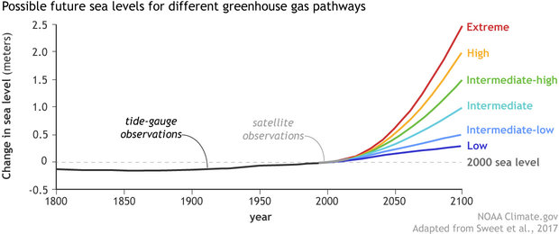

```{r setup, include=FALSE}
knitr::opts_chunk$set(echo = FALSE)
library(readxl)
library(dplyr)
library(ggplot2)
library(UsingR)
library(ggpmisc)
library(knitr)
library(car)
library(lmtest)
```

# PLAN DE LA CLASE
**1.- Introducción**
    
- Regresión lineal ¿Qué es y para qué sirve?
- Correlación v/s causalidad.
- Repaso ecuación de regresión lineal.
- Repaso betas y causalidad.
- Interpretación Regresión lineal con R.
- Evaluación de supuestos.

**2.- Práctica con R y Rstudio cloud**

- Realizar análisis de regresión lineal.
- Realizar gráficas avanzadas con ggplot2. 
- Elaborar un reporte dinámico en formato pdf.  

# INTRODUCCIÓN REGRESIÓN LINEAL

Herramienta estadística que permite determinar si existe una relación (asociación) entre una variable predictora (independiente) y la variable respuesta (dependiente).

Nivel del mar en función del tiempo. [Fuente: epa.gov](Fuente: https://www.epa.gov/climate-indicators/climate-change-indicators-sea-level.)
```{r, echo=FALSE, out.width = '75%', message=FALSE, fig.align='center'}
Sea_level <- read_excel("Sea_level.xlsx")
formula1 <- y ~ x

My_Theme = theme(
  axis.title.x = element_text(size = 20),
  axis.text.x = element_text(size = 20),
  axis.title.y = element_text(size = 20),
  axis.text.y = element_text(size = 20))


sea_level_dat <- Sea_level %>% filter(Year > 1992) 

q <- sea_level_dat %>% ggplot(aes(x = Year, y = `NOAA - Adjusted sea level (cm)`)) + 
   geom_point() +
   stat_smooth(method = "lm", col = "blue", show.legend=TRUE)+  stat_poly_eq(aes(label = paste0("atop(", ..eq.label.., ",", ..rr.label.., ")")), formula = formula1, parse = TRUE, size = 8) + scale_x_continuous(n.breaks = 8)
q+My_Theme
```

# REGRESIÓN LINEAL: PREDICCIÓN.

La ecuación de la regresión permite, bajo ciertos supuestos, predecir el valor de una variable respuesta “y” a partir de una o más variable predictoras “x”.

```{r, echo=FALSE, out.width = '100%',fig.align='center'}

```

# CORRELACIÓN NO IMPLICA CAUSALIDAD

¿Si dejamos de tomar helados disminuirá el nivel del mar?  
¿Qué factor "z" puede explicar la correlación entre consumo de helados y nivel del mar?   

```{r, message=FALSE, out.width = '80%', fig.align='center'}
r <- Sea_level %>% 
  filter(Year > 1992) %>% ggplot(aes(x = `Consumo de helados Chile (Litros)`, y = `NOAA - Adjusted sea level (cm)`)) + 
  geom_point(colour="black") +
  stat_smooth(method = "lm", col = "black", show.legend=TRUE)+  stat_poly_eq(aes(label = paste0("atop(", ..eq.label.., ",", ..rr.label.., ")")), 
               formula = formula1, parse = TRUE, size = 8)+scale_x_continuous(n.breaks = 8)
r+My_Theme
```


# REGRESIÓN LINEAL CAUSALIDAD

Calentamiento global [Fuente: climate.gov](https://www.climate.gov/maps-data/dataset/global-temperature-anomalies-graphing-tool)
```{r, echo=FALSE, out.width = '75%', message=FALSE, fig.align='center'}
Global_warming <- read_excel("Global_Warming.xlsx")
formula1 <- y ~ x
Global_warming$Year <- as.factor(Global_warming$Year)
Global_warming$CO2_ppm <- as.numeric(Global_warming$CO2_ppm)
Global_warming$`Global Temperature Anomalies` <- as.numeric(Global_warming$`Global Temperature Anomalies`)

My_Theme = theme(
  axis.title.x = element_text(size = 20),
  axis.text.x = element_text(size = 20),
  axis.title.y = element_text(size = 20),
  axis.text.y = element_text(size = 20))


s <- Global_warming %>% ggplot(aes(x = CO2_ppm, y = `Global Temperature Anomalies`)) + 
   geom_point() +
   stat_smooth(method = "lm", col = "red", show.legend=TRUE)+  stat_poly_eq(aes(label = paste0("atop(", ..eq.label.., ",", ..rr.label.., ")")), formula = formula1, parse = TRUE, size = 8)+scale_x_continuous(n.breaks = 8)
s+My_Theme
```

# REGRESIÓN LINEAL: BETAS

**Betas** miden la influencia del intercepto y la pendiente sobre la variable $Y$.

$Y = \beta_{0} + \beta_{1} X_{1} + \epsilon$

$\beta_{0}$ =  Intercepto = valor que toma “y” cuando x = 0.

$\beta_{1}$ = Pendiente =  Cambio promedio de “y” cuando “x” cambia en una unidad.

# LINEA DE REGRESIÓN.

**Línea de regresión**: Corresponde a los valores “ajustados” o estimados
de “y” en función de “x”. Se calcula con los estimadores de *mínimos cuadrados* de $\beta_{0} y \beta_{1}$


```{r, out.width = '80%', message=FALSE, fig.align='center'}
s+My_Theme
```

# RESIDUOS Y MÉTODOS DE MÍNIMOS CUADRADOS

```{r, echo=FALSE, out.width = '100%' }
knitr::include_graphics("Residuos.png")
```

# COCIENTE DE DETERMINACIÓN

**$R^2$** mide la proporción de la variación muestral de “y” que es explicada por x (varía entre 0-1). Se calcula como el cuadrado del coeficiente de correlación de pearson.

**$R^2_{ajust}$** nos dice qué porcentaje de la variación de la variable dependiente es explicado por la o las variables independientes de manera conjunta.

$R^2_{ajust} =1-(1-R^2)\frac{n-1}{n-p-1}$

donde: 

$n$ = tamaño de la muestra

$p$ = cantidad de variables predictoras en el modelo


# PRUEBAS DE HIPÓTESIS

**_Prueba de hipótesis del coeficiente de regresión y el intercepto_**
**Tipo de prueba**: Prueba de t – student  

La hipótesis nula en ambos casos es que los coeficiente ($\beta_0$) y ($\beta_1$) son iguales a 0, es decir sin asociación entre las variables.

$H_0:\beta_0 = 0$ y $H_0:\beta_1 = 0$

**_Prueba de hipótesis del modelo completo_**
**Tipo de prueba**: Prueba de F.

La hipótesis nula es que los coeficientes son iguales a 0.

$H_0:\beta_j = 0$ ; $j = 1, 2,...,k$


# REGRESIÓN LINEAL CON R: COEFICIENTES

```{r, echo=TRUE, warning=FALSE, message=FALSE, out.width = '80%'}
reg <- lm(`Global Temperature Anomalies`~ CO2_ppm, 
          data = Global_warming)
# summary(reg)
```

Coeficientes

||Estimate |Std. Error |t value |Pr(>|t|)    |
|---|---|---|---| ---|
|Intercepto | -3.18 |0.1629 | -19.54 |  <2e-16 ***|
| CO2        | 0.0099 | 0.0004  | 21.67 |  <2e-16 ***|

# REGRESIÓN LINEAL CON R: PRUEBA DE F

Anova de la regresión.
```{r, echo=TRUE}
anova(reg) %>% kable()
```


# EXTRAER INFORMACIÓN DE LA REGRESIÓN LINEAL

```{r, echo=TRUE, warning=FALSE, message=FALSE}

summary(reg$residuals)
summary(reg)$sigma
summary(reg)$r.squared
summary(reg)$adj.r.squared

```

# PREDICCIÓN LINEAL DEL NIVEL DEL MAR

Predicción de la anomalía próximos años

```{r, , echo=TRUE}
predict.lm(reg, newdata=data.frame(CO2_ppm=c(410,420,430)), 
           interval="confidence")
```

# PREDICCIÓN LINEAL FUERA DEL RANGO OBSERVADO

Predicción de aumeto de temperatura con 10 veces mas CO2 que ahora.

¿Por qué esta predicción es inadecuada?

```{r, echo=TRUE}
predict.lm(reg, newdata=data.frame(CO2_ppm=c(4100,4200,4300)), 
           interval="prediction")

```

# SUPUESTOS DE LA REGRESIÓN LINEAL SIMPLE

- ¿Cuales son los supuestos?  
Independencia.  
Linealidad entre variable independiente y dependiente.  
Homocedasticidad.  
Normalidad.  

- ¿Por qué son importantes?  
Para validar el resultado obtenido.  
En caso de incumplimiento se pueden transformar datos o elaborar otros modelos (Regresión logística).  


# INDEPENDENCIA: MÉTODO GRÁFICO

```{r, echo=TRUE}
plot(reg$residuals)
abline(h=0, col="red")

```

# LINEALIDAD: MÉTODO GRÁFICO

```{r, echo=TRUE}
plot(reg, which=1)
```

# INDEPENDENCIA: DURBIN WATSON

$H_0:$ No existe autocorrelación entre los datos (lo que deseamos).    
$H_0:$ Existe autocorrelación entre los datos.  

Dado que p < 0,05 se rechaza independencia.

```{r, echo=TRUE}
# durbin watson test
durbinWatsonTest(reg)
```

# HOMOGENEIDAD DE VARIANZAS: MÉTODO GRÁFICO

**H~0~**:  $\sigma^2_1$ = $\sigma^2_2$  
**H~A~**: $\sigma^2_1$ $\neq$ $\sigma^2_2$  

```{r, echo=TRUE}
plot(reg, which=3)
```

# HOMOGENEIDAD DE VARIANZAS: PRUEBAS ESTADÍSTICAS
p > .05, No tenemos eviencias para rechazar que nuestros datos son homocedasticos.

```{r, echo=TRUE}
ncvTest(reg) # library(car) 
bptest(reg) # library(lmtest)
```


# NORMALIDAD: GRÁFICO DE CUANTILES


```{r, echo=TRUE}
qqPlot(reg) # library(car)
```
# VALORES ATÌPICOS


```{r, echo=TRUE}
plot(reg, which=4)
plot(reg, which=5)
```


# PRÁCTICA ANÁLISIS DE DATOS
- Guía de trabajo práctico disponible en drive y Rstudio.cloud.  
**Clase_15**

- El trabajo práctico se realiza en Rstudio.cloud.  
**Guía 15 Regresión lineal**

# RESUMEN DE LA CLASE

- **Elaborar hipótesis para una regresión lineal**

- **Realizar análisis de regresión lineal simple**

- **Interpretar coeficientes y realizar predicciones**

- **Evaluar supuestos de los análisis de regresión**
