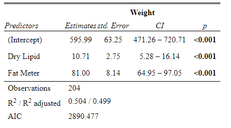
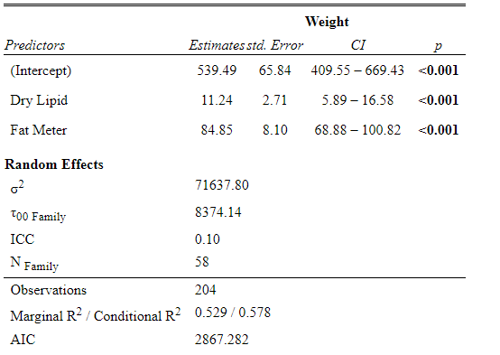

```{r setup, include=FALSE}
knitr::opts_chunk$set(echo = FALSE)
library(car)
library(lmtest)
library(psych)
library(readxl)
library(ggplot2)
library(dplyr)
library(knitr)
library(nlme)
library(lme4)
library(lmerTest)
library(multcomp)
library(sjPlot)
library(performance)
library(caret)
library(ggeffects) 
library(glmmTMB)
```

# **PLAN DE LA CLASE**

**1.- Introducción**
    
- Modelos lineales mixtos (MLM).

- Efectos fijos y efectos aleatorios.

- Ecuación del modelo lineal mixto (MLM).

- Interpretación de MLM con R.


**2.- Práctica con R y Rstudio cloud**

- Ajustar modelos lineales mixtos.

- Realizar gráficas avanzadas con ggplot2.

- Elaborar un reporte dinámico en formato pdf.


# **MODELOS LINEALES MIXTOS**

Los modelos lineales mixtos (MLM) son una generalización del modelo lineal de regresión clásico, contemplando la posible existencia de observaciones correlacionadas (ej. Medidas repetidas en el mismo individuo) o con variabilidad heterogénea, vinculadas a la presencia de factores aleatorios.

$$Y= X\beta + Zu + \epsilon$$
Efectos fijos ($X\beta$)

Efectos aleatorios ($Zu + \epsilon$)

Los modelos lineales mixtos surgen cuando no se cumplen los siguientes supuestos:

- Que hayan observaciones correlacionadas.

- Que NO haya homogeneidad de varianzas.


# **¿QUÉ SON EFECTOS FIJOS?**

- Los efectos fijos se asumen que son determinados a propósito por el analista de los datos, eso dependerá de las variables a las que se les desea estimar **efectos promedios**.

- Los efectos fijos solo estiman medias de las variables predictoras. 

- En un modelo lineal mixto las variables cuantitativas continuas (*_e.g._*, **Peso**) o factores (*_e.g._*,**Dieta**) pueden ser usadas como efectos fijos.
                
                 
# **¿QUÉ SON EFECTOS ALEATORIOS?**

- Los efectos aleatorios están asociados a grupos de observaciones.
Los efectos aleatorios estiman **varianzas**.

- Para considerar una variable predictora cualitativa como un efecto aleatorio del modelo lineal mixto, dicha variable debe tener al menos 5 niveles (**7 Familias**).

- Una variable predictora categórica con dos niveles (binaria) **NO** puede ser un efecto aleatorio.  

- Una variable aleatoria continua **NO** puede ser un efecto aleatorio. 

# **ALGUNOS EJEMPLOS DE EFECTOS ALEATORIOS**

i) Medidas repetidas sobre un mismo individuo (hay repeticiones).

ii) Respuestas observadas en grupos de unidades experimentales homogéneas (bloques), pueden ser piscinas o estanques.

iii) Mediciones de los animales (individuos) de una misma familia.

# **¿CÓMO SE PODRÍA DECIDIR SI ES EFECTO FIJO O ALEATORIO?**

**1).** ¿Cuál es el número de niveles?

- Pequeño (Fijo) (*_e.g._*, **Dieta** con tres niveles **D1, D2** y **D3**).

- Grande o infinito (Posiblemente aleatorio)  (*_e.g._*, **Familia** con 10 niveles **F1, F2**...**F10**).


**2).** ¿Son los niveles repetibles?

- Sí (Fijo) (*_e.g._*, **Dieta** podrías aplicarlas en diferentes lugares).

- No (Aleatorio) (*_e.g._*, **Familia** no podrías repetir las familias).


**3).** ¿Se necesitan realizar inferencias para niveles no incluidos en el muestreo?

- No (Posiblemente fijo) (*_e.g._*, **Dieta** D4 y D5).

- Sí (Posiblemente aleatorio) (*_e.g._*, **Familias** F11, F12).

# **ESTUDIO DE CASO: ANALISIS DE PRODUCCIÓN Y CALIDAD**

En este estudio de caso trabajaremos con un set de datos de producción y calidad de salmón Chinook (n=204) publicado en la revista [aquaculture](https://data.mendeley.com/datasets/rxvf8xrwrt/1).

Las variables de estudio se describen a continuación:

|  **Variable** | **Descripción**| 
|:-------------|:------------------| 
| **ID** | Identificación del individuo | 
| **Family** | Identificación familiar | 
| **Weight** | Peso en la cosecha (g) | 
| **Fat_Meter** | Concentración de lípidos medido con sensor |
| **Dry_Lipid** | Concentración de lípidos medido por gravimetría | 

# **BASE DE DATOS**
```{r,echo=FALSE}
quality <- read_excel("quality.xlsx")
quality$ID <- as.factor(quality$ID)
quality$Family <- as.factor(quality$Family)
quality_new <- quality[,c("Weight","Fat_Meter","Dry_Lipid")]

pander::pander(head(quality, caption = "Base de datos",10))
```

# **DISTRIBUCIÓN DE LA VARIABLE RESPUESTA (WEIGHT)**

```{r}
ggplot(quality, aes(x=Weight))+
  geom_histogram(color="darkblue", fill="lightblue", bins=6)+ labs(x="Weight (g)")+
  theme_classic()+theme(text = element_text(size=20,face="bold",colour="black"))
```

# **MODELO LINEAL**

```{r, echo=TRUE}
lm.quality <- lm(Weight ~ Dry_Lipid + Fat_Meter,
                 data = quality)
```


```{r,message=FALSE,warning=FALSE}
# PARA HACER TABLA CON RESULTADOS DE ML
#tab_model(lm.quality, show.se = TRUE, show.aic=TRUE)
```

```{r,echo=FALSE, out.width = '100%',fig.align='center'}

```

# **CUMPLIMIENTO DE SUPUESTOS**

**Independencia**

```{r}
#plot(lm.quality$residuals, pch=20, col = "blue")
 
dwtest(Weight ~ Dry_Lipid+Fat_Meter, data = quality,
       alternative = c("two.sided"), 
       iterations = 15)

```

# **CUMPLIMIENTO DE SUPUESTOS**

**Homogeneidad de varianzas**

```{r}
#plot(lm.quality, 1, pch=20, col = "blue")
bptest(lm.quality)
```

# **CUMPLIMIENTO DE SUPUESTOS**

**Normalidad**

```{r}
#plot(lm.quality, 2, pch=20, col = "blue")
lm_residuals <- residuals(object = lm.quality)
shapiro.test(x= lm_residuals)
```

# **CUMPLIMIENTO DE SUPUESTOS**

**Multicolinealidad**

```{r, ut.width = '75%', message=FALSE, fig.align='center'}
pairs.panels(quality_new)
```

# **CUMPLIMIENTO DE SUPUESTOS**

**Linealidad**

```{r, message=FALSE,warning=FALSE}
q <- ggplot(quality_new, aes(x = Fat_Meter, y = Weight))
q + geom_point() + xlab("Concentración de lípidos por sensor (%)") +  ylab("Weight (g)")+ geom_smooth(method=lm)+theme_classic()+theme(text = element_text(size=20,face="bold",colour="black"))
```

# **CUMPLIMIENTO DE SUPUESTOS**

**Linealidad**

```{r, message=FALSE,warning=FALSE}
m <- ggplot(quality_new, aes(x = Dry_Lipid, y = Weight))
m + geom_point() + xlab("Concentración de lipidos por gravimetría (%)") +  ylab("Weight (g)")+ geom_smooth(method=lm)+theme_classic()+theme(text = element_text(size=20,face="bold",colour="black"))
```

# **GRÁFICO DE DISPERSIÓN POR FAMILIA**

```{r}
ggplot(data = quality, aes(x = Fat_Meter, y = Weight, color = Family)) +
  geom_point() +
xlab("Concentración de lipidos por gravimetría (%)") +  ylab("Weight (g)")+theme_classic()+theme(text = element_text(size=20,face="bold",colour="black"))+theme(legend.position="none")
```

# **MODELOS LINEALES MIXTOS**


```{r, echo=TRUE}
library(lme4)
```

Función **lmer**

```{r, echo=FALSE}
n_families <- as.data.frame(length(levels(quality$Family)))
colnames(n_families) <- c("Cantidad de Familias")
```

```{r}
n_families%>% kable(align = "ccc")
```

* Familia se puede considerar como efecto **aleatorio**.

# **MODELO LINEAL MIXTO**

```{r,echo=TRUE,fig.align='center'}
MLM <- lmer(Weight ~ Dry_Lipid + Fat_Meter + (1|Family),
            data = quality)
```


```{r, echo=FALSE, message=FALSE,warning=FALSE}
# PARA HACER TABLA CON RESULTADOS DE MLM
#tab_model(MLM,p.val = "kr", show.se = TRUE, show.aic=TRUE)
```

```{r,echo=FALSE, out.width = '95%',fig.align='center'}

```

# **$R^2 Marginal$ y $R^2 Condicional$**

* $R^2_{Marginal}$: **proporción de la varianza explicada solo por los efectos fijos**.

* $R^2_{Condicional}$: **proporción de la varianza explicada por todo el modelo**.

```{r, echo=TRUE}
r2_nakagawa(MLM)
```

# **SELECCIÓN DE MODELOS (AIC) **

Criterios de selección de modelos AIC

```{r,echo=FALSE,out.width = '30%',fig.align='center'}

AIC_lm.quality<- AIC(lm.quality)
AIC_MLM <-AIC(MLM)
AIC <- rbind(AIC_lm.quality,AIC_MLM)
colnames(AIC) <- c("AIC")
rownames(AIC) <- c("Modelo lineal", "Modelo lineal mixto")

```

```{r,echo=TRUE,out.width = '30%',fig.align='center'}

AIC %>% kable()
```
# **RESUMEN DE LA CLASE**

**1).** Modelos lineales mixtos.


**2).** Construir y ajustar modelos lineales mixtos.

    